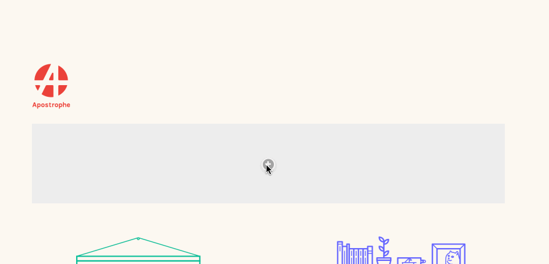
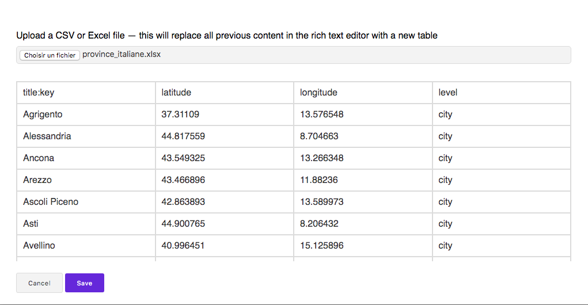
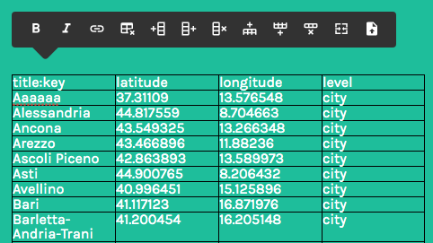

[](https://circleci.com/gh/apostrophecms/apostrophe-tiptap-rich-text-widgets/tree/master)



## Why?

Many users of ApostropheCMS are aware of our plans to use the Vue-based [Tiptap](https://tiptap.scrumpy.io/) editor in Apostrophe 3.x. This module provides an early technology preview of that editor for Apostrophe 2.x. When present it replaces the CKEditor 4.x-based rich text editing experience that ships with ApostropheCMS.

## Stability

As a technology preview, this module currently has a special stability policy:

* We will undertake to avoid bc breaks in the use of the module, as documented, as a rich text editor.
* However, changes will likely be made to the way new components, tooltip extensions, etc. can be added.
* We expect that instability to cease around the time Apostrophe 3.x is released.

So if you're just using it as a rich text editor, you may regard it as stable. But if you are extending it, you should expect to be an active participant in developing the module in parallel with the evolution of Apostrophe 3.x.

One area that may be subject to change beyond these guidelines is the `link` button, which may at some point be subdivided into more than one button for a better user experience.

## Requirements

You must use Node 8 or better.

## Installation

```
# First, cd to the root of your existing Apostrophe 2.x project. Then...

npm install apostrophe-tiptap-rich-text-widgets
```

## Configuration

```javascript
// in app.js
require('apostrophe')({
  modules: {
    'apostrophe-tiptap-rich-text-widgets': {}
  }
});
```

```javascript
// in whatever html page
{{
  apos.area(data.page, 'areaNameYouWant', {
    widgets: {
      'apostrophe-rich-text': {
        toolbar: ['bold', 'italic', 'link', 'table', 'import'],
        styles: [
          {
            tag: 'p',
            label: 'Paragraph'
          },
          {
            tag: 'h3',
            label: 'Heading'
          },
          {
            tag: 'h3',
            'class': 'right',
            label: 'Heading (Right)'
          }
        ]
      }
    }
  })
}}
```
Each time an `apostrophe-rich-text` widget is added to a template, the `toolbar` and `styles` options are mandatory.

All rich text editor widgets on the site now use [tiptap](https://tiptap.scrumpy.io/) instead of CKEditor.

## CKEditor-compatible toolbar configuration

tiptap and CKEditor are not the same and do not have identical features. Identical behavior is not guaranteed. However many common CKEditor toolbar options are accepted.

## Native tiptap toolbar configuration

In addition, the following toolbar items are accepted natively:

`bold`
`italic`
`strike`
`link`
`horizontal_rule`
`bullet_list`
`ordered_list`
`blockquote`
`code_block`
`styles`
`undo`
`redo`
`table`

All of these require no configuration, with the exception of `styles`. The `styles` toolbar item, if present, must be configured via the `styles` option. It is used to provide a choice of block elements, potentially with a choice of CSS classes:

```javascript
styles: [
  // For now, for best results you MUST configure styles, and your styles MUST
  // include the paragraph tag with no classes as one of the options.
  // You may have other options based on the `p` tag that do have classes.
  // The requirement to include `p` is likely to remain due to the way
  // tiptap handles line breaks inside list items, etc.
  {
    tag: 'p',
    label: 'Paragraph'
  }
  {
    tag: 'h3',
    label: 'Heading'
  },
  {
    tag: 'h3',
    'class': 'right',
    label: 'Heading (Right)'
  }
]
```

**The `class` property may contain several space-separated class names.**

> The `name` and `element` properties are accepted as fallbacks for `label` and `tag`, for backwards compatibility.

Another option is `import`, allowing to import a CSV or Excel file in a table.


It has a preview feature:



Then, the imported table is editable:



## Adding more tiptap extensions

You can write your own tiptap extensions, either at project level in `lib/modules/apostrophe-rich-text-widgets/src/apos/extensions`, or in an npm module that also uses `improve` to enhance `apostrophe-rich-text-widgets` and is configured *after* this module. These extensions will be autoloaded if present.

Similarly you can write your own Vue components to provide UI for those extensions in `src/apos/components`.

See the existing `src/apos/extensions` and `src/apos/components` folders of this module for examples.

If you add extensions, you must run this task to rebuild the frontend JavaScript code:

```
node app apostrophe-tiptap-widgets:build
```

This will create the file:

```
lib/modules/apostrophe-rich-text/public/js/public-tiptap-bundle.js
```

And that will become part of the assets pushed to your browser from this point on. You should commit it and deploy it as you would any source file. If you decide you don't want any custom extensions after all, you should remoe it.

These are advanced techniques requiring a good understanding of tiptap internals.

## Preserving additional tags and attributes

There is a default `sanitize-html` configuration in this package to save `colspan` and `rowspan` attributes, which the table editor of this module can produce.

```javascript
sanitizeHtml: {
  allowedAttributes: {
    a: ['href', 'name', 'target'],
    td: ['colspan', 'rowspan'],
    th: ['colspan', 'rowspan']
  }
}
```

You can add your own configuration. It will be merged with the default one. For instance:
```javascript
// in app.js
modules: {
  'apostrophe-rich-text-widgets': {
    sanitizeHtml: {
      allowedTags: ['b', 'i', 'em', 'strong', 'a', 'img'],
      allowedAttributes: {
        img: ['src']
      }
    }
  }
}
```

## Using this widget for just some of your rich text

This module "improves" `apostrophe-rich-text-widgets`, meaning that all of your rich text will use Tiptap.

However, it is also possible to enable it only for certain subclasses of `apostrophe-rich-text-widgets`. Here is how to do it, in `app.js`:

```javascript
modules: {
  'apostrophe-tiptap-rich-text-widgets': {},
  'apostrophe-rich-text-widgets': {
    tiptap: false
  },
  'apostrophe-tiptap-widgets': {
    extend: 'apostrophe-rich-text-widgets',
    tiptap: true,
    label: 'Tiptap Rich Text'
  }
}
```

In a template you may now use the two side by side:

```javascript
apos.area(data.page, 'body', {
  widgets: {
    'apostrophe-rich-text': {
      toolbar: ['Bold', 'Italic', 'Link']
    },
    'apostrophe-tiptap': {
      toolbar: ['bold', 'italic', 'link', 'table']
    }
  }
});
```

One common use case is to gain Tiptap's rich table editing features while not fully committing to its use for all text.

> We don't use `apostrophe-tiptap-rich-text` as the widget name because that is the name of this npm module, which enhances all rich text widgets via the `improve` keyword and is not available for direct use as a module name in its own right.

## Contributing to this module

Feel free! Be aware that if you add or modify the Vue components and extensions in the npm module itself, you will need to run:

```
# NOTE: apostrophe-rich-text-widgets, NOT apostrophe-tiptap-rich-text-widgets
node app apostrophe-rich-text-widgets:build --npm
```

Otherwise the asset bundle is built at project level. Note that when you use `--npm` project-level extensions and components are *not* included in the bundle, since their source code won't be there for anyone else who installs the module.

> **If you have a project-level `lib/modules/apostrophe-rich-text-widgets/public/js/project-tiptap-bundle.js` file, that will get loaded instead when you run `node app`, so make sure you remove that to test your build before submitting a PR.**

> If you are following "using this module for just some of your rich text" above, you will need to substitute the name of your custom module that extends `apostrophe-rich-text-widgets` when running the build task.
